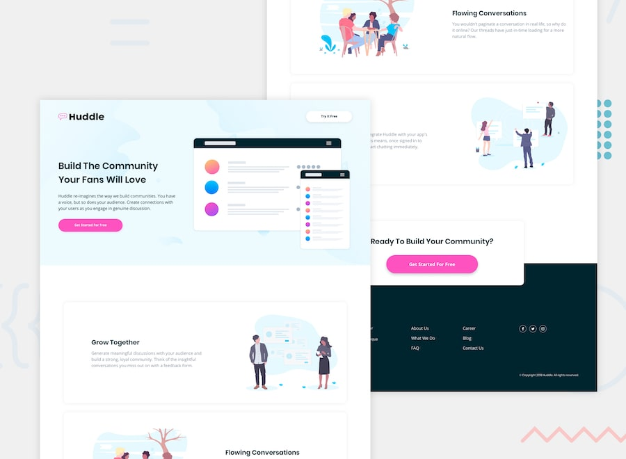

# Frontend Mentor - Huddle landing page with alternating feature blocks

This is a solution to the [Huddle landing page with alternating feature blocks challenge on Frontend Mentor](https://www.frontendmentor.io/challenges/huddle-landing-page-with-alternating-feature-blocks-5ca5f5981e82137ec91a5100). Frontend Mentor challenges help you improve your coding skills by building realistic projects.

## Table of contents

- [Overview](#overview)
  - [Screenshot](#screenshot)
  - [Links](#links)
- [My process](#my-process)
  - [Built with](#built-with)
  - [Extra feature](#extra-feature)
  - [What I learned](#what-i-learned)

## Overview

### Screenshot

### Links

- [Solution URL](https://github.com/MATBMS/huddle-landing-page-with-feature)
- [Live Site URL](https://matbms-huddle-landing-page-feature.netlify.app/)

## My process

### Built with

- Semantic HTML5 markup
- CSS custom properties
- Flexbox
- CSS Grid
- Mobile-first workflow

### Extra feature

As a first-time visitor interested in joining Huddle, 
I want to be told immediately when my attempt to sign up can't go through, 
so that I understand my sign-up didn't fail silently and know to try later.

### What I learned

This challenge didn't teach me a brand-new technique — it was mostly reps on things I'd already practised: CSS custom properties, Flexbox and Grid, a mobile-first workflow, and a small vanilla-JS interaction. The value was building a full multi-section landing page end to end and keeping the CSS organised across `base/`, `components/` and `pages/`.
